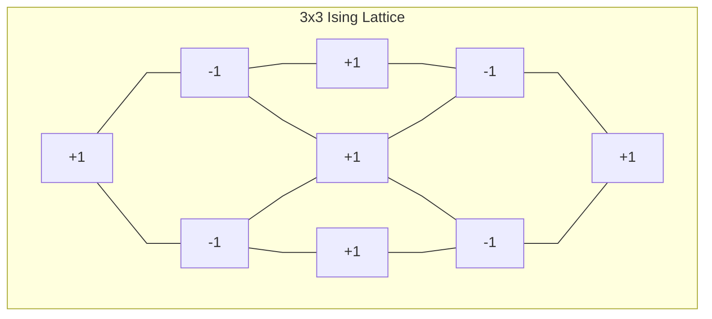

# Ising Model Simulation with Metropolis & Glauber Dynamics



This project implements a **2D Ising model** on an \(`L` x `L`\) lattice at temperature \(`T`\), demonstrating **Monte Carlo** simulations using both **Metropolis** and **Glauber** update rules. It also includes a basic **autocorrelation** analysis via **Fourier transforms** (FFT) to estimate decorrelation times.

---

## Table of Contents

1. [Features](#features)  
2. [Getting Started](#getting-started)  
3. [Usage](#usage)  
4. [Project Structure](#project-structure)  
5. [Details & Methods](#details--methods)  

---

## Features

- **Class-Based**: An `Ising` class encapsulates parameters (\(L\), \(T\)) and manages simulation data (energy \(E\) and magnetization \(M\)).  
- **Monte Carlo Updates**:
  - **Metropolis rule**  
  - **Glauber rule**  
- **Lattice Snapshots**: Plots the spin configuration at various timesteps.  
- **Energy & Magnetization Tracking**: Accumulates average values during the simulation.  
- **FFT Analysis**:  
  - **Power Spectrum** of the magnetization signal.  
  - **Approximate Autocorrelation Time** estimation.  
  - **Inverse FFT** to reconstruct signals.  
- **Temperature Variation**: Demonstrates simulations at different temperatures, including near the critical point (2D Ising \( T_c \approx 2.27 \)).

---

## Getting Started

### Requirements

- **Python 3.7+**  
- **NumPy**  
- **Matplotlib**  
- **SciPy** (for `scipy.fft`)  

Install via `pip`:

```bash
pip install numpy matplotlib scipy
```

### Installation

1. **Clone** the repository:

   ```bash
   git clone https://github.com/DanielDiGiovanni-py/IsingSImulation.git
   cd IsingSImulation
   ```

2. **Install dependencies**:

   ```bash
   pip install numpy matplotlib scipy
   ```

3. **Run** the script:

   ```bash
   python ising_sim.py
   ```

---

## Usage

1. **Main Simulation**:  
   - The script runs two simulations on a 32 x 32 grid at \(T = 3.2691\).  
   - First with the **Metropolis** rule, then with **Glauber**.  
   - Plots snapshots of spin configurations at selected timesteps.  
   - Computes and plots the FFT of the magnetization signal, obtains an approximate autocorrelation time, then plots the inverse FFT.  

2. **Critical Temperature**:  
   - Repeats the same procedure at \(T = 2.2691\) (near the 2D Ising critical temperature).  

3. **Adjusting Parameters**:  
   - **Lattice Size**: Change `L` in the constructor, e.g. `Ising(64, 2.2691)`.  
   - **Temperature**: Modify `T`.  
   - **Monte Carlo Steps**: Adjust `mc_steps` in the `simulate` method.  
   - **Plot Frequency**: The script plots intermediate snapshots at specific timesteps (`i == 1, 4, 32, 100, 1000`), which you can change.

---

## Project Structure

```
.
├── ising_sim.py        # Main script containing the Ising class and demo usage
├── README.md           # This readme
└── ...
```

- **`ising_sim.py`** :
  - **`Ising` class**:  
    - `__init__(L, T)`: Initializes lattice parameters and data arrays.  
    - `monte_carlo_move(...)`: Runs a Monte Carlo sweep (either Metropolis or Glauber).  
    - `simulate(...)`: Drives the full simulation, saves snapshots, updates energy & magnetization.  
    - `calc_energy(...)`: Computes total energy of the lattice.  
    - `calc_magnetization(...)`: Computes the total magnetization.  
    - `config_plot(...)`: Helper function to visualize spin configurations.  
  - **`if __name__ == "__main__":**: Runs two sets of simulations (at `T=3.2691` and `T=2.2691`) and performs FFT analysis.

---

## Details & Methods

1. **Ising Model**:  
   - Each site has a spin \( s_{i,j} \in \{+1, -1\} \).  
   - **Energy** per site is \( E = - \sum \limits_{\langle i,j\rangle} s_i \, s_j \), summing over nearest neighbors.  

2. **Update Rules**:
   - **Metropolis**: Flip a random spin if \(\Delta E \le 0\). Else flip with probability \(\exp(-\Delta E \beta)\).  
   - **Glauber**: Flip a random spin with probability \( 0.5 \left(1 - \tanh\left(\frac{\Delta E \, \beta}{2}\right)\right)\).  

3. **FFT & Autocorrelation**:
   - Magnitudes of the FFT give an estimate of power at different frequencies.  
   - Approximate autocorrelation time \(\tau \approx \frac{|A_0|}{\sqrt{\langle m^2 \rangle}}\), where \(A_0\) is the zero-frequency component and \(\langle m^2 \rangle\) is the mean square magnetization.  
   - **Inverse FFT** used to reconstruct signals, as a demonstration.

---

**Happy Physic-ing!**
